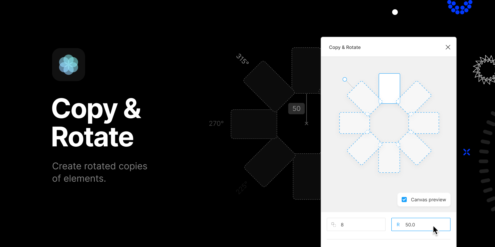

Create radial interfaces and patterns in Figma with instantiated, rotated copies of elements.

## 🚧 Development

1. `npm i` — Install dependencies
1. `npm run watch` — Bundle the plugin and watch for changes 👁️

## 🌀 Misc

This plugin uses the amazing [create-figma-plugin](https://github.com/yuanqing/create-figma-plugin) library.

## 📝 License

[MIT](LICENSE)
